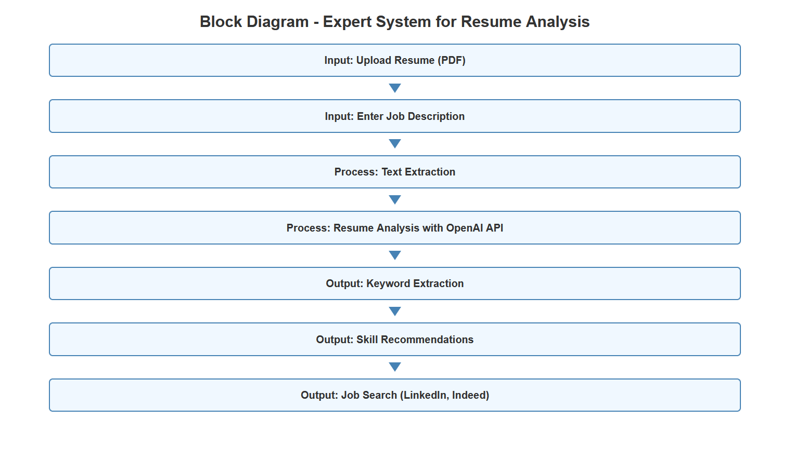
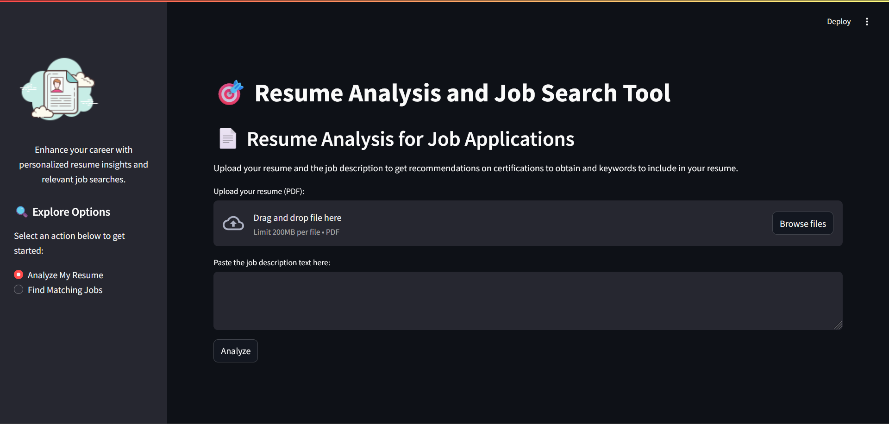
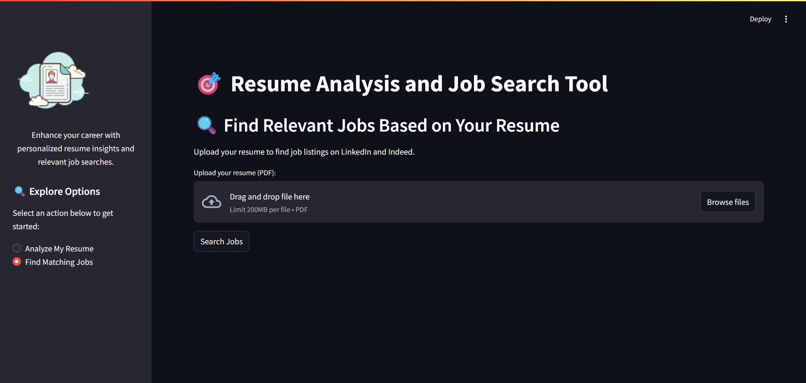

# 🎯 Resume Analysis and Job Search Tool

This project is a web-based application that helps students and job seekers analyze their resumes against job descriptions to optimize their chances of getting through Applicant Tracking Systems (ATS) and landing their desired jobs. The tool leverages OpenAI's GPT model to provide insights on missing skills, certifications, and keywords that can enhance a resume's relevance to a specific job.

## 📑 Features

- **Resume Analysis**: Upload a PDF of your resume and compare it to a job description to get recommendations on certifications, skills, and keywords to include in your resume.
- **Job Search**: Find job listings on LinkedIn and Indeed that match the skills and experience outlined in your resume.

## 🚀 How It Works

1. **Upload Resume**: Users can upload their resume in PDF format.
2. **Enter Job Description**: Users can input the job description they are targeting.
3. **Text Extraction**: The system extracts text from the uploaded PDF resume.
4. **Resume Analysis**: The extracted resume text is analyzed using the OpenAI GPT model against the job description.
5. **Keyword and Skill Extraction**: The tool identifies missing keywords and skills that can improve the resume's chances of getting noticed.
6. **Job Search**: Based on the resume content, the tool finds matching job listings on LinkedIn and Indeed.

## 📊 Block Diagram

Below is the block diagram of the expert system for resume analysis:



## 🛠️ Technology Stack

- **Frontend**: Streamlit for the user interface.
- **Backend**: Python for server-side logic and text processing.
- **APIs**: OpenAI GPT for natural language processing and analysis.

## 📝 How to Run the Project

1. Clone the repository to your local machine.
    ```bash
    git clone https://github.com/doshibhomik/AIDI2001FinalProject.git
    cd AIDI2001FinalProject
    ```

2. Install the required dependencies.
    ```bash
    pip install -r requirements.txt
    ```

3. Run the Streamlit application.
    ```bash
    streamlit run app.py
    ```

4. Access the application by navigating to `http://localhost:8501` in your web browser.

## 📚 Learnings

This project helped me understand the importance of integrating machine learning models with web applications. I learned how to use OpenAI's GPT model for text analysis and gained experience in building interactive user interfaces with Streamlit.

## 🔗 Links

- [Streamlit Documentation](https://docs.streamlit.io/)
- [OpenAI API Documentation](https://platform.openai.com/docs/api-reference/introduction)

## 📷 Screenshots





## 📄 About

---

*This project was developed as part of a course assignment.*
